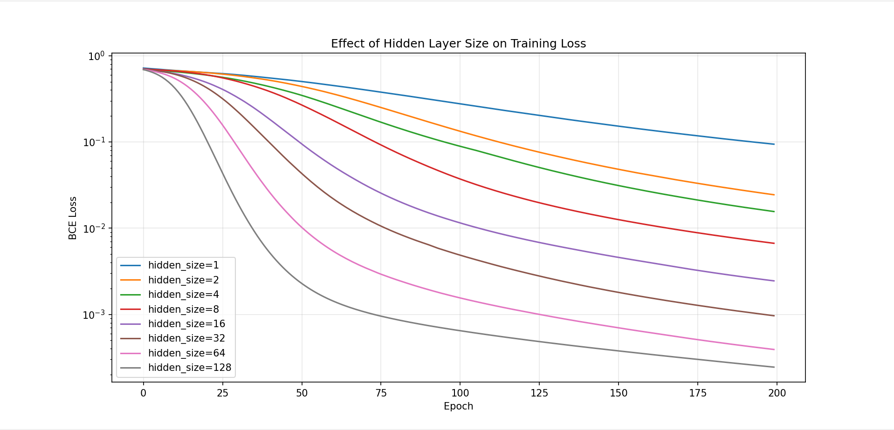

# NLP Movie Sentiment

A small experiment in binary sentiment classification on movie reviews, built from scratch with
TF-IDF features and a two-layer PyTorch neural network.

The main question it explores: **how does hidden layer size affect training loss?** The script
trains the same architecture at hidden sizes `[1, 2, 4, 8, 16, 32, 64, 128]` — each from an
identical random seed for a fair comparison — and plots all eight loss curves on a log scale.

## What's inside

- **Data** — 21 hand-written sentences (11 positive, 10 negative), defined inline.
- **Features** — `TfidfVectorizer` from scikit-learn.
- **Model** — `Linear → ReLU → Linear → Sigmoid`, trained with `BCELoss` and Adam (`lr=0.01`)
  for 200 epochs.
- **Output** — a matplotlib chart of loss vs. epoch per hidden size, then predictions on five
  unseen test sentences.

## Running it

```bash
pip install torch scikit-learn numpy matplotlib
python sentiment.py
```

A plot window opens with the comparison chart. Close it and the test predictions print to stdout.

## Results



Larger hidden layers drive the training loss down faster and further. With `hidden_size=1` the
loss is still around 0.1 after 200 epochs. With `hidden_size=128` it drops below 10⁻³ by about
epoch 75. Each doubling of the hidden size lowers the final loss, though the gains get smaller
from 64 to 128.

## Notes

This is a learning project, not a serious classifier. The dataset is tiny and the model trains
and evaluates on the same 21 sentences, so the loss curves show *fitting capacity* rather than
anything about generalization. Test sentences containing words absent from the training
vocabulary get TF-IDF vectors of all zeros, which is worth keeping in mind when reading the
predictions.
